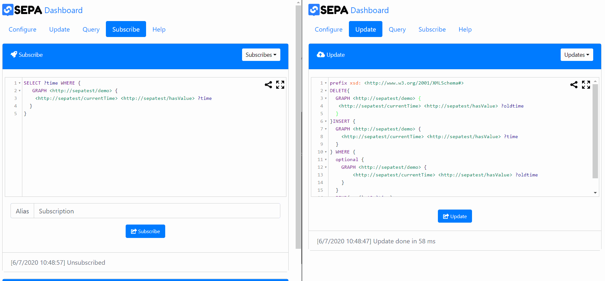

<div align="center">
  <a href="https://github.com/arces-wot/SEPA">
    
  </a>
  <br>
  <br>
  <a href="https://travis-ci.org/arces-wot/SEPA">
    
  </a>
  <a href="https://bintray.com/arces-wot/sepa-java-libs/client-api">
    
  </a>
  <a href="https://github.com/arces-wot/SEPA/releases">
    
  </a>
  <a href="https://github.com/arces-wot/SEPA/tree/dev">
    
  </a>
  <a href="https://gitter.im/sepa_dev/Lobby#">
    
  </a>
  <br>
   <a href="https://www.gnu.org/licenses/gpl-3.0">
    
  </a>
  <a href="hhttps://www.gnu.org/licenses/lgpl-3.0">
    
  </a>
  
</div>

## Table of Contents
- [Introduction](#introduction)
- [Demo](#demo)
- [Quick start](#quick-start)
- [Configuration](#configuration)
- [Usage](#usage)
- [Contributing](#contributing)
- [History](#history)
- [Credits](#credits)

## Introduction
SEPA (**S**PARQL **E**vent **P**rocessing **A**rchitecture) is a publish-subscribe architecture designed to support information level interoperability. The architecture is built on top of generic SPARQL endpoints (conformant with [SPARQL 1.1 protocol](https://www.w3.org/TR/sparql11-protocol/)) where publishers and subscribers use standard **SPARQL 1.1** [Updates](https://www.w3.org/TR/sparql11-update/) and [Queries](https://www.w3.org/TR/sparql11-query/). Notifications about events (i.e., changes in the **RDF** knowledge base) are expressed in terms of added and removed SPARQL binding results since the previous notification. To know more about SEPA architecture and vision please refer to this [paper](https://www.mdpi.com/1999-5903/10/4/36/htm). SEPA proposal has been formalized in the following *unofficial dratfs*:
- [SPARQL Event Processing Architecture (SEPA)](http://mml.arces.unibo.it/TR/sepa.html) contribute [here](https://github.com/arces-wot/SEPADocs/blob/master/sepa.html)
- [SPARQL 1.1 Secure Event Protocol](http://mml.arces.unibo.it/TR/sparql11-se-protocol.html) contribute [here](https://github.com/arces-wot/SEPADocs/blob/master/sparql11-se-protocol.html)
- [SPARQL 1.1 Subscribe Language](http://mml.arces.unibo.it/TR/sparql11-subscribe.html) contribute [here](https://github.com/arces-wot/SEPADocs/blob/master/sparql11-subscribe.html)
- [JSON SPARQL Application Profile (JSAP)](http://mml.arces.unibo.it/TR/jsap.html) contribute [here](https://github.com/arces-wot/SEPADocs/blob/master/jsap.html)

## Demo



## Quick start

- Download the [SEPA Engine](https://github.com/arces-wot/SEPA/releases/latest) and run it: `java -jar engine-x.y.z.jar`

- Download [Blazegraph](https://sourceforge.net/projects/bigdata/files/latest/download) (or use any other SPARQL 1.1 Protocol compliant service) and run it as shown [here](https://wiki.blazegraph.com/wiki/index.php/Quick_Start) 

- Use the [SEPA Playground](http://mml.arces.unibo.it/apps/dashboard?mode=local) to check basic functionalities of the engine.

### For Hackers 💻👩‍💻👨‍💻
<a href="https://asciinema.org/a/251211">
  
</a>

## Configuration
The SEPA engine can be used with different SPARQL endpoints which must support SPARQL 1.1 protocol. The endpoint can be configured using
a JSON file `endpoint.jpar`. Furthermore, the engine has various parameters that can be used to configure the standard behavior; they
can be set using another JSON file called `engine.jpar`.  
In the repository, you will find some versions of `endpoint-{something}.jpar` file. According to your underlying SPARQL endpoint, you have to rename the correct file to `endpoint.jpar`.
The default version of `endpoint.jpar` configures the engine to use use a local running instance of Blazegraph as [SPARQL 1.1 Protocol Service](https://www.w3.org/TR/sparql11-protocol/).

```json
{
"host":"localhost",
"sparql11protocol":{
  "protocol":"http",
  "port":9999,
  "query":{
    "path":"/blazegraph/namespace/kb/sparql",
    "method":"POST",
    "format":"JSON"},
  "update":{
    "path":"/blazegraph/namespace/kb/sparql",
    "method":"POST",
    "format":"JSON"}}}
```
The default version of  `engine.jpar` configures the engine to listen for incoming [SPARQL 1.1 SE Protocol](http://mml.arces.unibo.it/TR/sparql11-se-protocol/) requests at the following URLs:

1. Query: http://localhost:8000/query
2. Update: http://localhost:8000/update
3. Subscribe/Unsubscribe: ws://localhost:9000/subscribe
4. SECURE Query: https://localhost:8443/secure/query
5. SECURE Update: https://localhost:8443/secure/update
6. SECURE Subscribe/Unsubscribe: wss://localhost:9443/secure/subscribe 
7. Regitration: https://localhost:8443/oauth/register
8. Token request: https://localhost:8443/oauth/token
```json
{"parameters":{
  "scheduler":{
   "queueSize":100,
   "timeout":5000},
  "processor":{
   "updateTimeout":5000,
   "queryTimeout":5000,
   "maxConcurrentRequests":5,
   "reliableUpdate":true},
  "spu":{"timeout":5000},
  "gates":{
   "security":{
    "tls":false,
    "enabled":false,
    "type":"local"},
   "paths":{
    "secure":"/secure",
    "update":"/update",
    "query":"/query",
    "subscribe":"/subscribe",
    "unsubscribe":"/unsubscribe",
    "register":"/oauth/register",
    "tokenRequest":"/oauth/token"},
   "ports":{
    "http":8000,
    "https":8443,
    "ws":9000,
    "wss":9443}}}}
```
### Logging
SEPA uses [log4j2](http://logging.apache.org/log4j/2.x/) by Apache. A default configuration is stored in the file log4j2.xml provided with the distribution. If the file resides in the engine folder, but it is not used, add the following JVM directive to force using it:

java `-Dlog4j.configurationFile=./log4j2.xml` -jar engine-x.y.z.jar

### Security
By default, the engine implements a simple in-memory [OAuth 2.0 client-credential flow](https://auth0.com/docs/flows/client-credentials-flow). It uses a JKS for storing the keys and certificates for [SSL](http://docs.oracle.com/cd/E19509-01/820-3503/6nf1il6ek/index.html) and [JWT](https://tools.ietf.org/html/rfc7519) signing/verification. A default `sepa.jks` is provided including a single X.509 certificate (the password for both the store and the key is: `sepa2017`). If you face problems using the provided JKS, please delete the `sepa.jks` file and create a new one as follows: `keytool -genkey -keyalg RSA -alias sepakey -keystore sepa.jks -storepass sepa2017 -validity 360 -keysize 2048`
Run `java -jar engine-x.y.z.jar -help` for a list of options. The Java [Keytool](https://docs.oracle.com/javase/6/docs/technotes/tools/solaris/keytool.html) can be used to create, access and modify a JKS. 
SEPA also implements other two security mechanisms:
- LDAP: it extends the default one by storing clients's information into an LDAP server (tested with [Apache Directory](https://directory.apache.org/))
- KEYCLOAK: authentication based on OpenID Connect in managed by [Keycloak](https://www.keycloak.org/)

Security is configured within the `engine.jpar` as follows:
```json
{"gates":{
  "security":{
    "tls": false,
    "enabled": true,
    "type": "local"
}}}
```
where 
- `type` can assume one of the following values: `local`,`ldap`,`keycloak`
- `tls` is used when `type`=`ldap` to enable or not LDAP StartTLS

### JMX monitoring
The SEPA engine is also distributed with a default [JMX](http://www.oracle.com/technetwork/articles/java/javamanagement-140525.html) configuration `jmx.properties` (including the `jmxremote.password` and `jmxremote.access` files for password and user grants). Remember to change password file permissions using: `chmod 600 jmxremote.password`. To enable remote JMX, the engine must be run as follows: `java -Dcom.sun.management.config.file=jmx.properties -jar engine-x.y.z.jar`. Using [`jconsole`](http://docs.oracle.com/javase/7/docs/technotes/guides/management/jconsole.html) is possible to monitor and control the most important engine parameters. By default, the port is `5555` and the `root:root` credentials grant full control (read/write).

### Usage
The SEPA engine can be configured from the command line. Run `java -jar engine-x.y.z.jar -help` for the list of available settings.

`java [JMX] [JVM] [LOG4J] -jar SEPAEngine_X.Y.Z.jar [-help] [-secure=true] [-engine=engine.jpar] [-endpoint=endpoint.jpar] [JKS OPTIONS] [LDAP OPTIONS] [ISQL OPTIONS]`

- `secure` : overwrite the current secure option of engine.jpar
- `engine` : can be used to specify the JSON configuration parameters for the engine (default: engine.jpar)
- `endpoint` : can be used to specify the JSON configuration parameters for the endpoint (default: endpoint.jpar)
- `help` : to print this help

[JMX]
- `Dcom.sun.management.config.file=jmx.properties` : to enable JMX remote managment

[JVM]
- `XX:+UseG1GC`

[LOG4J]
- `Dlog4j.configurationFile=path/to/log4j2.xml`

[JKS OPTIONS]
- `sslstore` <jks> : JKS for SSL CA      			(default: ssl.jks)
- `sslpass` <pwd> : password of the JKS        	(default: sepastore)
- `jwtstore` <jks> : JKS for the JWT key       	(default: jwt.jks)
- `jwtalias` <alias> : alias for the JWT key   	(default: jwt)
- `jwtstorepass` <pwd> : password for the JKS  	(default: sepakey)
- `jwtaliaspass` <pwd> : password for the JWT key  (default: sepakey)
		
[LDAP OPTIONS]
- `ldaphost` <name> : host     		         (default: localhost)
- `ldapport` <port> : port                      (default: 10389)
- `ldapdn` <dn> : domain                        (default: dc=sepatest,dc=com)
- `ldapusersdn` <dn> : domain                   (default: null)
- `ldapuser` <usr> : username                   (default: null)
- `ldappwd` <pwd> : password                    (default: null)
		
[ISQL OPTIONS]
- `isqlpath` <path> : location of isql     		 (default: /usr/local/virtuoso-opensource/bin/)
- `isqlhost` <host> : host of Virtuoso     		 (default: localhost)
- `isqluser` <user> : user of Virtuoso     		 (default: dba)
- `isqlpass` <pass> : password of Virtuoso     	 (default: dba)

## Contributing
You are very welcome to be part of SEPA community. If you find any bug feel free to open an issue here on GitHub, but also feel free to
ask any question. For more details check [Contributing guidelines](CONTRIBUTING.md). Besides, if you want to help the SEPA development follow this simple steps:

1. Fork it!
2. Create your feature branch: `git checkout -b my-new-feature`
3. Check some IDE specific instruction below
4. Do your stuff
5. Provide tests for your features if applicable
5. Commit your changes: `git commit -am 'Add some feature'`
6. Push to the branch: `git push origin my-new-feature`
7. Submit a pull request :D

Pull request with unit tests have an higher likelihood to be accepted, but we are not to restrictive. So do not be afraid to send your contribution!

### Clone in Eclipse
There is no particular restriction in your IDE choice. Here we provide a short guide to import the GitHub cloned project inside Eclipse. Any 
other IDEs work fine. 

1. Open Eclipse
2. File > Import > Maven
3. Choose "Check out Maven Projects from SCM"
4. In the field SCM URL choose 'git' and add the clone address from Github. If 'git' is not found, tap into "Find more SCM connectors in the m2e Marketplace"
5. go on...
The project is cloned. Enjoy!

### Build with Maven
SEPA engine is a Maven project composed by two sub-projects:
- Client-api
- Engine

As first, you need to build client-api skipping JUnit tests:
```bash
mvn install -DskipTests
```
In fact, clien-api JUnit tests include integration tests that require a SEPA engine running

Then you can build the engine with this command:
```bash
mvn install
```
That create an executable inside the target directory. To know more about Maven please refer to the [official documentation](https://maven.apache.org/).

## History

SEPA has been inspired and influenced by [Smart-M3](https://sourceforge.net/projects/smart-m3/). SEPA authors have been involved in the development of Smart-M3 since its [origin](https://artemis-ia.eu/project/4-sofia.html). 

The main differences beetween SEPA and Smart-M3 are the protocol (now compliant with the [SPARQL 1.1 Protocol](https://www.w3.org/TR/sparql11-protocol/)) and the introduction of a security layer (based on TLS and JSON Web Token for client authentication). 

All the SEPA software components have been implemented from scratch.

## Credits

SEPA stands for *SPARQL Event Processing Architecture*. SEPA is promoted and maintained by the [**Dynamic linked data and Web of Things Research Group**](https://site.unibo.it/wot/en) @ [**ARCES**](http://www.arces.unibo.it), the *Advanced Research Center on Electronic Systems "Ercole De Castro"* of the [**University of Bologna**](http://www.unibo.it).

## License

SEPA Engine is released under the [GNU GPL](https://github.com/arces-wot/SEPA/blob/master/engine/LICENSE), SEPA APIs are released under the  [GNU LGPL](https://github.com/arces-wot/SEPA/blob/master/client-api/LICENSE)