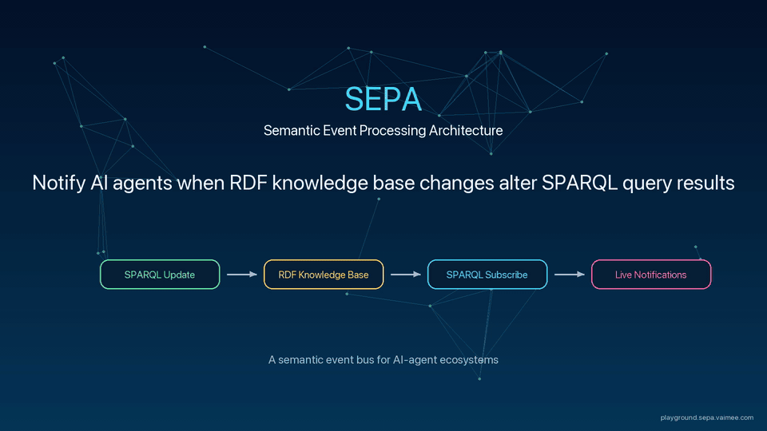

<div align="center">
  <a href="https://github.com/vaimee/SEPA">
    
  </a>
  <h1><font color="#10B1D8">SEPA - SPARQL Event Processing Architecture</font></h1>
  <a href="https://github.com/vaimee/SEPA/releases/latest">
    
  </a>
  <a href="https://central.sonatype.com/search?q=g%3Acom.vaimee%20sepa">
    
  </a>
  <a href="https://discord.gg/TqX8F6hkx">
    
  </a>
  <a href="https://www.gnu.org/licenses/gpl-3.0">
    
  </a>
  <a href="https://www.gnu.org/licenses/lgpl-3.0">
    
  </a>
  <br><br>
</div>

# A semantic event bus for AI-agent ecosystems

## Table of Contents
- 🚀 [Introduction](#introduction)
- ⚡ [Quick Start](#quick-start)
- ⚙️ [Configuration](#configuration)
- 🧰 [Usage](#usage)
- 🛠️ [Build with Maven ](#build-with-maven)
- 🤝 [Contributing](#contributing)
- 🙌 [Credits](#credits)

<a id="introduction"></a>

## 🚀 Introduction

SEPA (**S**PARQL **E**vent **P**rocessing **A**rchitecture) is a publish-subscribe architecture designed to support information level interoperability.

The architecture is built on top of generic SPARQL endpoints conformant with the [SPARQL 1.1 Protocol](https://www.w3.org/TR/sparql11-protocol/). Publishers and subscribers use standard **SPARQL 1.1** [Updates](https://www.w3.org/TR/sparql11-update/) and [Queries](https://www.w3.org/TR/sparql11-query/).

Notifications about events, such as changes in the **RDF** knowledge base, are expressed as added and removed SPARQL binding results since the previous notification. To learn more about the SEPA architecture and vision, refer to this [paper](https://www.mdpi.com/1999-5903/10/4/36/htm).

SEPA has been formalized in the following *unofficial drafts*:
- [SPARQL Event Processing Architecture (SEPA)](https://vaimee.org/TR/sepa.html) contribute [here](https://github.com/vaimee/SEPA/blob/main/TR/sepa.html)
- [SPARQL 1.1 Secure Event Protocol](https://vaimee.org/TR/sparql11-se-protocol.html) contribute [here](https://github.com/vaimee/SEPA/blob/main/TR/sparql11-se-protocol.html)
- [SPARQL 1.1 Subscribe Language](http://vaimee.org/TR/sparql11-subscribe.html) contribute [here](https://github.com/vaimee/SEPA/blob/main/TR/sparql11-subscribe.html)
- [JSON SPARQL Application Profile (JSAP)](http://vaimee.org/TR/jsap.html) contribute [here](https://github.com/vaimee/SEPA/blob/main/TR/jsap.html)

<h2 id="quick-start">⚡ Quick Start</h2>

You can play with SEPA on our [dashboard](https://playground.sepa.mdw.vaimee.com). 🕹️

🛠️ To build SEPA from source, see [Build with Maven](#build-with-maven).

<h2 id="build-with-maven">🛠️ Build with Maven</h2>
SEPA is a Maven multi-module project composed of four sub-projects:
- Client API
- Engine
- Dashboard
- Chat

Java 25 and Maven are required to build the current project.

Build and install all modules locally with tests skipped:
```bash
mvn clean install -DskipTests -Dgpg.skip=true
```

`-DskipTests` is needed for the local reactor build because the `api-java` module includes integration tests that require a running SEPA engine. `-Dgpg.skip=true` skips artifact signing for local builds.

The build creates executable shaded JARs in the module `target` directories, including the SEPA engine JAR:
```bash
engine/target/sepa-engine-<version>.jar
```

Run the `api-java` integration tests with a Maven-started in-memory SEPA engine:
```bash
mvn -pl api-java verify -Pwith-sepa-engine -Dgpg.skip=true
```

The `with-sepa-engine` profile requires the engine JAR to have already been built by the previous reactor command. It starts `engine/target/sepa-engine-<version>.jar` during the Maven `pre-integration-test` phase using `engine/src/main/resources/endpoints/jena-in-memory.jpar`, waits for ports `8000` and `9000`, runs the Failsafe integration tests, and stops the engine when Maven exits. Engine output is written to:
```bash
api-java/target/sepa-engine.log
```

The complete local verification flow is therefore:
```bash
mvn clean install -DskipTests -Dgpg.skip=true
mvn -pl api-java verify -Pwith-sepa-engine -Dgpg.skip=true
```

To know more about Maven, refer to the [official documentation](https://maven.apache.org/).

<h2 id="configuration">⚙️ Configuration</h2>
The SEPA engine can be used with different SPARQL endpoints which must support SPARQL 1.1 protocol. The endpoint can be configured using
a JSON file `endpoint.jpar`. Furthermore, the engine has various parameters that can be used to configure the standard behavior; they
can be set using another JSON file called `engine.jpar`.  
In the repository, you will find some versions of `endpoint-{something}.jpar` file. According to your underlying SPARQL endpoint, you have to rename the correct file to `endpoint.jpar`.
The default version of `endpoint.jpar` configures the engine to use a local running instance of Blazegraph as [SPARQL 1.1 Protocol Service](https://www.w3.org/TR/sparql11-protocol/).

```json
{
"host":"localhost",
"sparql11protocol":{
  "protocol":"http",
  "port":9999,
  "query":{
    "path":"/blazegraph/namespace/kb/sparql",
    "method":"POST",
    "format":"JSON"},
  "update":{
    "path":"/blazegraph/namespace/kb/sparql",
    "method":"POST",
    "format":"JSON"}}}
```
The default version of  `engine.jpar` configures the engine to listen for incoming [SPARQL 1.1 SE Protocol](http://vaimee.org/TR/sparql11-se-protocol/) requests at the following URLs:

1. Query: http://localhost:8000/query
2. Update: http://localhost:8000/update
3. Subscribe/Unsubscribe: ws://localhost:9000/subscribe
4. SECURE Query: https://localhost:8443/secure/query
5. SECURE Update: https://localhost:8443/secure/update
6. SECURE Subscribe/Unsubscribe: wss://localhost:9443/secure/subscribe 
7. Registration: https://localhost:8443/oauth/register
8. Token request: https://localhost:8443/oauth/token
```json
{"parameters":{
  "scheduler":{
   "queueSize":100,
   "timeout":5000},
  "processor":{
   "updateTimeout":5000,
   "queryTimeout":5000,
   "maxConcurrentRequests":5,
   "reliableUpdate":true},
  "spu":{"timeout":5000},
  "gates":{
   "security":{
    "tls":false,
    "enabled":false,
    "type":"local"},
   "paths":{
    "secure":"/secure",
    "update":"/update",
    "query":"/query",
    "subscribe":"/subscribe",
    "unsubscribe":"/unsubscribe",
    "register":"/oauth/register",
    "tokenRequest":"/oauth/token"},
   "ports":{
    "http":8000,
    "https":8443,
    "ws":9000,
    "wss":9443}}}}
```
### 📝 Logging
SEPA uses [log4j2](http://logging.apache.org/log4j/2.x/) by Apache. A default configuration is stored in the file log4j2.xml provided with the distribution. If the file resides in the engine folder, but it is not used, add the following JVM directive to force using it:

java `-Dlog4j.configurationFile=./log4j2.xml` -jar engine-x.y.z.jar

### 🔐 Security
By default, the engine implements a simple in-memory [OAuth 2.0 client-credential flow](https://auth0.com/docs/flows/client-credentials-flow). It uses a JKS for storing the keys and certificates for [SSL](http://docs.oracle.com/cd/E19509-01/820-3503/6nf1il6ek/index.html) and [JWT](https://tools.ietf.org/html/rfc7519) signing/verification. A default `sepa.jks` is provided including a single X.509 certificate (the password for both the store and the key is: `sepa2017`). If you face problems using the provided JKS, please delete the `sepa.jks` file and create a new one as follows: `keytool -genkey -keyalg RSA -alias sepakey -keystore sepa.jks -storepass sepa2017 -validity 360 -keysize 2048`
Run `java -jar engine-x.y.z.jar -help` for a list of options. The Java [Keytool](https://docs.oracle.com/javase/6/docs/technotes/tools/solaris/keytool.html) can be used to create, access and modify a JKS. 
SEPA also implements other two security mechanisms:
- LDAP: it extends the default one by storing clients's information into an LDAP server (tested with [Apache Directory](https://directory.apache.org/))
- KEYCLOAK: authentication based on OpenID Connect in managed by [Keycloak](https://www.keycloak.org/)

Security is configured within the `engine.jpar` as follows:
```json
{"gates":{
  "security":{
    "tls": false,
    "enabled": true,
    "type": "local"
}}}
```
where 
- `type` can assume one of the following values: `local`,`ldap`,`keycloak`
- `tls` is used when `type`=`ldap` to enable or not LDAP StartTLS

### 📊 JMX Monitoring
The SEPA engine is also distributed with a default [JMX](http://www.oracle.com/technetwork/articles/java/javamanagement-140525.html) configuration `jmx.properties` (including the `jmxremote.password` and `jmxremote.access` files for password and user grants). Remember to change password file permissions using: `chmod 600 jmxremote.password`. To enable remote JMX, the engine must be run as follows: `java -Dcom.sun.management.config.file=jmx.properties -jar engine-x.y.z.jar`. Using [`jconsole`](http://docs.oracle.com/javase/7/docs/technotes/guides/management/jconsole.html) is possible to monitor and control the most important engine parameters. By default, the port is `5555` and the `root:root` credentials grant full control (read/write).

<h3 id="usage">🧰 Usage</h3>
The SEPA engine can be configured from the command line. Run `java -jar engine-x.y.z.jar -help` for the list of available settings.

`java [JMX] [JVM] [LOG4J] -jar SEPAEngine_X.Y.Z.jar [-help] [-secure true] [-engine engine.jpar] [-endpoint endpoint.jpar] [JKS OPTIONS] [LDAP OPTIONS] [ISQL OPTIONS]`

- `secure` : overwrite the current secure option of engine.jpar
- `engine` : can be used to specify the JSON configuration parameters for the engine (default: engine.jpar)
- `endpoint` : can be used to specify the JSON configuration parameters for the endpoint (default: endpoint.jpar)
- `help` : to print this help

[JMX]
- `Dcom.sun.management.config.file=jmx.properties` : to enable JMX remote managment

[JVM]
- `XX:+UseG1GC`

[LOG4J]
- `Dlog4j.configurationFile=path/to/log4j2.xml`

[JKS OPTIONS]
- `sslstore` <jks> : JKS for SSL CA      			(default: ssl.jks)
- `sslpass` <pwd> : password of the JKS        	(default: sepastore)
- `jwtstore` <jks> : JKS for the JWT key       	(default: jwt.jks)
- `jwtalias` <alias> : alias for the JWT key   	(default: jwt)
- `jwtstorepass` <pwd> : password for the JKS  	(default: sepakey)
- `jwtaliaspass` <pwd> : password for the JWT key  (default: sepakey)
		
[LDAP OPTIONS]
- `ldaphost` <name> : host     		         (default: localhost)
- `ldapport` <port> : port                      (default: 10389)
- `ldapdn` <dn> : domain                        (default: dc=sepatest,dc=com)
- `ldapusersdn` <dn> : domain                   (default: null)
- `ldapuser` <usr> : username                   (default: null)
- `ldappwd` <pwd> : password                    (default: null)
		
[ISQL OPTIONS]
- `isqlpath` <path> : location of isql     		 (default: /usr/local/virtuoso-opensource/bin/)
- `isqlhost` <host> : host of Virtuoso     		 (default: localhost)
- `isqluser` <user> : user of Virtuoso     		 (default: dba)
- `isqlpass` <pass> : password of Virtuoso     	 (default: dba)


<h2 id="contributing">🤝 Contributing</h2>
You are very welcome to be part of SEPA community. If you find any bug feel free to open an issue here on GitHub, but also feel free to
ask any question. For more details check [Contributing guidelines](CONTRIBUTING.md). Besides, if you want to help the SEPA development follow this simple steps:

1. Fork it!
2. Create your feature branch: `git checkout -b my-new-feature`
3. Check some IDE specific instruction below
4. Do your stuff
5. Provide tests for your features if applicable
6. Commit your changes: `git commit -am 'Add some feature'`
7. Push to the branch: `git push origin my-new-feature`
8. Submit a pull request :D

Pull request with unit tests have an higher likelihood to be accepted, but we are not to restrictive. So do not be afraid to send your contribution!

<h2 id="credits">🙌 Credits</h2>

SEPA has been inspired and influenced by [Smart-M3](https://sourceforge.net/projects/smart-m3/). SEPA authors have been involved in the development of Smart-M3 since its [origin](https://artemis-ia.eu/project/4-sofia.html).

The main differences between SEPA and Smart-M3 are the protocol (now compliant with the [SPARQL 1.1 Protocol](https://www.w3.org/TR/sparql11-protocol/)) and the introduction of a security layer (based on TLS and JSON Web Token for client authentication).

All the SEPA software components have been implemented from scratch.

## 📄 License

SEPA Engine is released under the [GNU GPL](https://github.com/vaimee/SEPA/blob/main/engine/LICENSE), SEPA APIs are released under the [GNU LGPL](https://github.com/vaimee/SEPA/blob/main/api-java/LICENSE)
