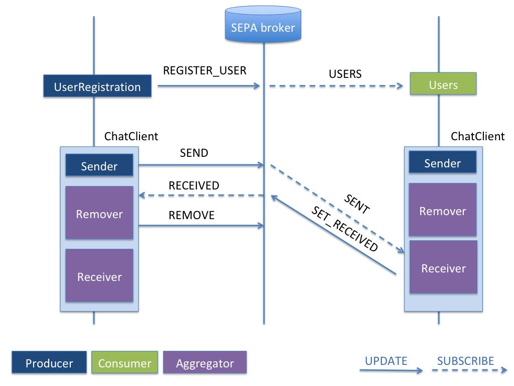

# SEPA-Chat

This project is a simple SEPA based chat application. The application exemplifies the use of the SEPA client API. The API can be used at two different levels:

1. [SPARQL 1.1 Secure Event (SE) protocol](http://mml.arces.unibo.it/TR/sparql11-se-protocol.html)
2. [JSON SPARQL Application Profile (JSAP)](http://mml.arces.unibo.it/TR/jsap.html)

The project shows the use of the API at both levels. The application uses the JAVA API which are included in the [SEPA Java reference implementation](https://github.com/arces-wot/SEPA), but the same concepts apply to all the other APIs (like JS and Python).

The main component is the `ChatClient` which consists of three SEPA agents:

1. `Sender` (*producer*)
2. `Receiver` (*aggregator*)
3. `Remover` (*aggregator*)

The application also includes two components (`Users` and `UserRegistration`) for the chat users management. 

## Data model: the ontology
[Schema.org](https://schema.org/) has been used as reference ontology. In particular, the following are the JSON-LD representation of a user and a message:

**JSON-LD example of a chat user**<br>

```json
{"@context" : {"schema" : "https://schema.org/"},
"@id" : "chat:UserURI",
"@type" : "schema:Person",
"schema:name" : "Luca Roffia" }
```

**JSON-LD example of a chat message**<br>

```json
{"@context" : {"schema" : "https://schema.org/", "chat": "http://wot.arces.unibo.it/chat#"},
"@id" : "chat:MessageURI",
"@type" : "schema:Message",
"schema:text" : "The text of the message",
"schema:sender" : "chat:UserURI1",
"schema:toRecipient" : "chat:UserURI2",
"schema:dateSent" : "2019-07-31T14:54:30Z",
"schema:dateReceived" : "2019-07-31T15:24:10Z" }
```
## Users registration: a typical SEPA producer
A new user can be registered thanks to the following simple component, a SEPA *producer*.

```java
public class UserRegistration extends Producer {
	
public UserRegistration(JSAP jsap,SEPASecurityManager sm) throws ... {
  super(jsap, "REGISTER_USER",sm);
}
	
public void register(String userName) {
  try {
    this.setUpdateBindingValue("userName", new RDFTermLiteral(userName));
	update();
  } 
  catch (...) {}
}
}
```

The **"REGISTER_USER"** string is the identifier of the SPARQL update to be used by the producer. Such update should be present within the JSAP and in our example it looks like the following:

```json
"REGISTER_USER": {
	"sparql": "WITH <http://wot.arces.unibo.it/chat/> DELETE {?x rdf:type schema:Person . ?x schema:name ?userName} INSERT {?person rdf:type schema:Person ; schema:name ?userName}  WHERE {BIND(IRI(CONCAT(\"http://wot.arces.unibo.it/chat/person_\",STRUUID())) AS ?person) OPTIONAL {?x rdf:type schema:Person . ?x schema:name ?userName}}",
	"forcedBindings": {
		"userName": { "type": "literal", "value": "My user name"}
	}
}
```

It could be interesting to note the use of the **forced bindings**, variables whose values can be set by the client before calling the update (see *this.setUpdateBindingValue("userName", new RDFTermLiteral(userName));*). All the forced bindings will be replaced by the API and a check will be made on the name and type of the variable (i.e., for literal values the dataTyoe can also be specified).

## Be notified on registered/unregistered users: a typical SEPA consumer
The `Users` component (a SEPA *consumer*) can be used to subscribe to the registration/cancellation of users. The code of such a component follows:

```java
public class Users extends Consumer {	

private HashMap<String, String> usersList = new HashMap<String, String>();
private boolean joined = false;
private boolean usersRetrieved = false;

public Users(JSAP jsap,SEPASecurityManager sm) throws ... {
  super(jsap, "USERS",sm);
}

public void joinChat() throws ... {
  while (!joined) {
    subscribe(5000);
    synchronized(this) {wait(1000);}
  }
  while (!usersRetrieved) {
    synchronized(this) {wait(1000);}
  }
}

public void leaveChat() throws ... {
  while (joined) {
    unsubscribe(5000);
    synchronized(this) {wait(1000);}
  }
}

public Set<String> getUsers() {
  synchronized (usersList) {return usersList.keySet();}
}

public String getUserName(String user) {
  synchronized (usersList) {return usersList.get(user);}
}

@Override
public void onSubscribe(String spuid, String alias) {
  synchronized(this) { joined = true; notify(); }
}
	
@Override
public void onFirstResults(BindingsResults results) {
  onAddedResults(results);
  synchronized(this) { usersRetrieved = true; notify(); }
}
	
@Override
public void onResults(ARBindingsResults results) {
  synchronized (usersList) {
  for (Bindings bindings : results.getRemovedBindings().getBindings()) {
    usersList.remove(bindings.getValue("user"));
  }
  for (Bindings bindings : results.getAddedBindings().getBindings()) {
    usersList.put(bindings.getValue("user"), bindings.getValue("userName"));
  }
}}

@Override
public void onBrokenConnection() {
  joined = false;
  try { joinChat();} catch (...) {}
}

@Override
public void onUnsubscribe(String spuid) {
  synchronized(this) { joined = false; notify(); }
}
	
@Override
public void onError(ErrorResponse errorResponse) {}
@Override
public void onAddedResults(BindingsResults results) {}
@Override
public void onRemovedResults(BindingsResults results) {}	
}
```

The client subscribes using the SPARQL query identified by **"USERS"** within the JSAP and it receives notifications as follows:

1. The `onSubscribe` is called once the client has been subscribed
2. The `onFirstResults` is called once at subscription time to communicate the current results of the query
3. The `onResults` is called every time the result of the query changes. The notification includes the added and removed bindings since the previous notification. The utility methods `onAddedResults` and `onRemovedResults` can be used instead if the client is interested in just the added or removed results.
4. The `onUnsubscribe` is called once the client has been unsubscribed
5. The `onError` and `onBrokenConnection` are called in case of error or if the connection has been aborted

The request of subscription is performed by calling the `subscribe` method. Forced bindings can be also used with subscriptions if needed.

## Chatting: SEPA aggregators and the SEPA application design pattern
The following diagram shows the sequence of operations involved during a chat.



The `UserRegistration` and `Users` clients have been previously presented. The first is a *producer* (it performs SPARQL updates), while the second is a *consumer* (it is subscribed by means of a SPARQL query).
A ChatClient can be seen as composed by three SEPA clients: `Sender`, `Receiver` and `Remover`. While the first is a *producer*, the last two are *aggregators*. 

An *aggregator* is an extension of a consumer: it subscribes and when a notification is received it performs an update. The two above mentioned aggregators extend abstract class `ChatAggregator` whose code fragment follows:

```java
public abstract class ChatAggregator extends Aggregator {

private boolean joined = false;
	
public ChatAggregator(String subscribeID, String updateID) throws ... {
  super(new ConfigurationProvider().getJsap(), subscribeID, updateID, new ConfigurationProvider().getSecurityManager());
}

public void joinChat() throws ... {
  while (!joined) { 
    subscribe(1000);
    synchronized (this) {wait(1000);}
  }
}

public void leaveChat() throws ... {
  while (joined) {
    unsubscribe(5000);
    synchronized (this) {wait(1000);}
  }
}
	
@Override
public void onBrokenConnection() {
  joined = false;
  try { joinChat();} catch (...) {}
}

@Override
public void onSubscribe(String spuid, String alias) {
  synchronized(this) { joined = true; notify(); }
}

@Override
public void onUnsubscribe(String spuid) {
  synchronized(this) { joined = false; notify();}
}
	
@Override
public void onResults(ARBindingsResults results) {}
@Override
public void onRemovedResults(BindingsResults results) {}
@Override
public void onAddedResults(BindingsResults results) {}
@Override
public void onFirstResults(BindingsResults results) {}
@Override
public void onError(ErrorResponse errorResponse) {}
}
```

The role of this abstract class is to implement a mechanism for the automatic re-join in case of connection lost. The join state is stored in the `join` field. In case of connection lost (`onBrokenConnection`), the client tries to join again the chat (which means to subscribe again).

The code fragment of the `Receiver` aggregator follows:

```java
class Receiver extends ChatAggregator {
	
public Receiver(String userUri,...) throws ... {
  super("SENT", "SET_RECEIVED");
  this.setSubscribeBindingValue("receiver", new RDFTermURI(userUri));
}

@Override
public void onAddedResults(BindingsResults results) {
  for (Bindings bindings : results.getBindings()) {
    try {
	  this.setUpdateBindingValue("message", new RDFTermURI(bindings.getValue("message")));
      update();
    } 
	catch (...) {}
  }
}
}
```

The client subscribes using the **"SENT"** SPARQL query and it force the variable `receiver` to the URI of the user so that it will receive notification of messages sent to that user. 

```json
"SENT": {
  "sparql": "SELECT ?message ?sender ?name ?text ?time WHERE {GRAPH <http://wot.arces.unibo.it/chat/> {?message rdf:type schema:Message ; schema:text ?text ; schema:sender ?sender ; schema:toRecipient ?receiver ; schema:dateSent ?time . ?sender rdf:type schema:Person ; schema:name ?name . ?receiver rdf:type schema:Person}} ORDER BY ?time",
  "forcedBindings": {
    "receiver": { "type": "uri", "value": "chat:IAmAReceiver"}
  }
}
```
When a notification is received, the client updates the receiving timestamp by calling the **"SET_RECEIVED"** SPARQL update, setting the message URI to the same URI of the message that has been notified.

```json
"SET_RECEIVED": {
  "sparql": "WITH <http://wot.arces.unibo.it/chat/> INSERT {?message schema:dateReceived ?time} WHERE {?message rdf:type schema:Message . BIND(STR(now()) AS ?time)}",
  "forcedBindings": {
    "message": { "type": "uri", "value": "chat:ThisIsAMessage"}
  }
}
```

## Chat Monitor: a generic SEPA client


## JSAP: a look into the SPARQL Application Profile

